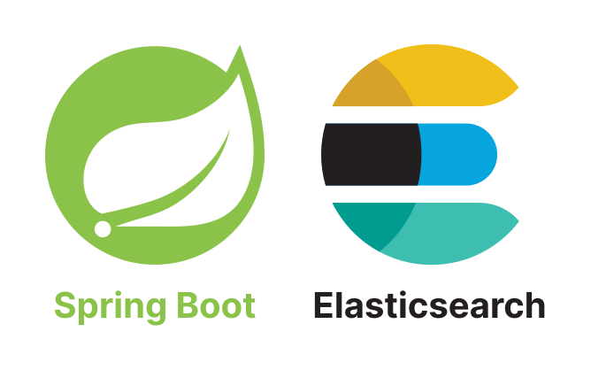

# Java Spring Boot + Elasticsearch

This repository demonstrates very simple demo example of implementing and using Elasticsearch.
This example is a simple full CRUD application.

# 0. Technologies used

| Technology       | Version   |
|------------------|-----------|
| Java Spring Boot | `v3.2.3`  |
| Docker           | `v25.0.3` |
| Docker Compose   | `v2.22.0` |
| Elasticsearch    | `v8.12.2` |

# 1. What is Elasticsearch?

Elasticsearch is a distributed, RESTful search and analytics engine designed for horizontal scalability, reliability,
and real-time search capabilities. It is built on top of Apache Lucene, which is a high-performance, full-featured text
search engine library written in Java.
